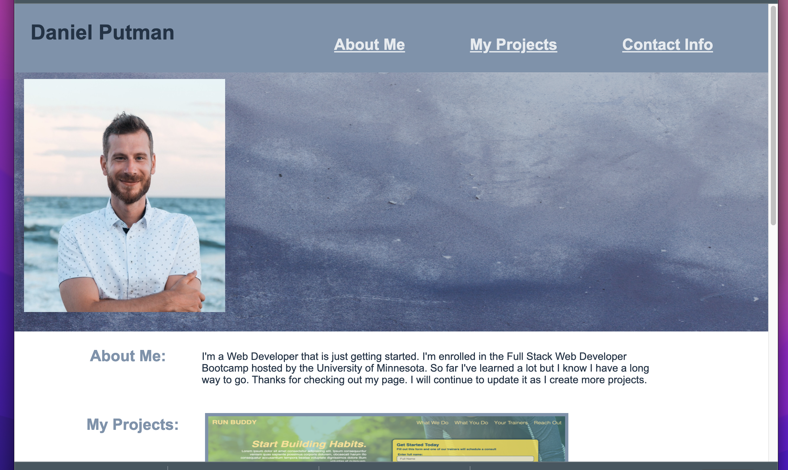
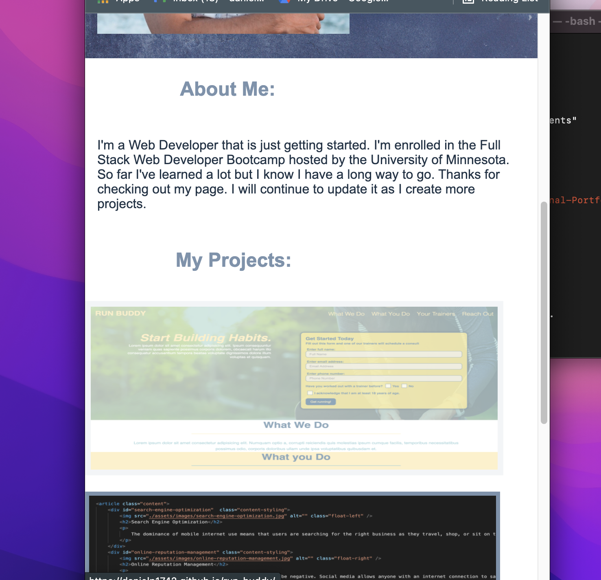

### Professional-Portfolio Project

## The Why of this Project:
This project was about creating a Professional Protofolio for myself. It this project there was no starter code.  This is all code I have personally written.  It could be used to show potential employeers a gallery of our completed projects. The follow are things the site does:

## Display my info:
The site has a recent photo of me, plus a short paragraph about me as a developer.  Also, has links to my email, GitHub and Linkin.  Also my facebook profile is hidden in my face.

## Functioning Navigation bar
When clicking on the Navigation bar at the top of the screen it takes you to that section of my page.

## Links to the projects:
The image tiles work as links to my projects hosted on GitHub.  One of my applications is larger on my page which was a project requirement.

## The page is resizeable for different applications:
This site uses some flex elements which makes it functional for smaller screen sizes.  I also have Media Queries which resize some of the images.

## Final thoughts are reflections:
This project was a great from scratch project to create. I'm proud that I learned a few things along the way.  Adding Media Queries and Pseudo Classes was a great last touch.  For future improvements I would love to spend more time with flex getting the page to display a bit differently on smaller sizes.  But over all proud of the work considering I've only been coding for about 4 weeks.  

## Here are some images of the site:

